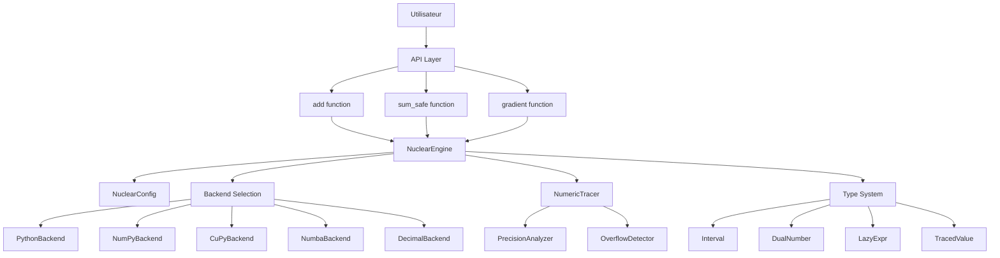
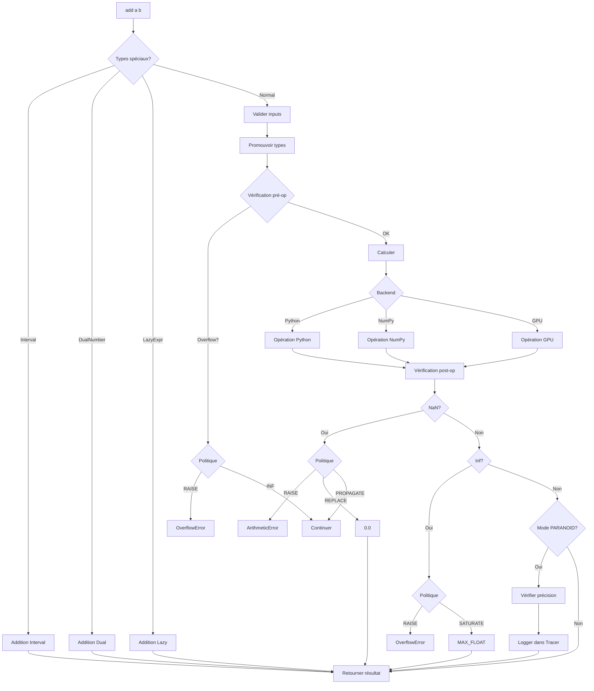
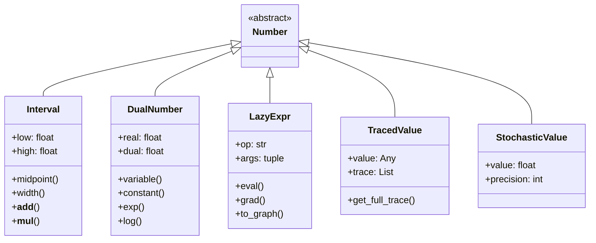
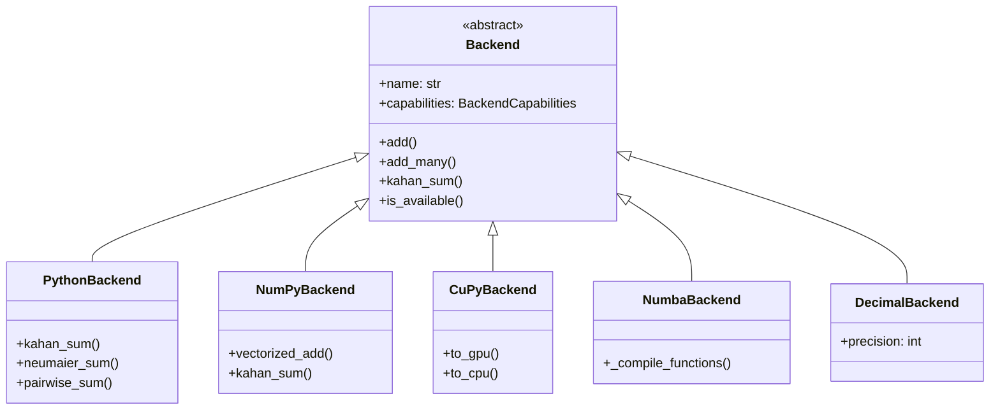
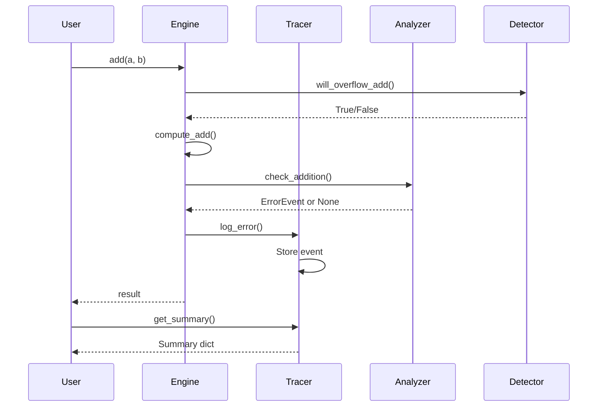
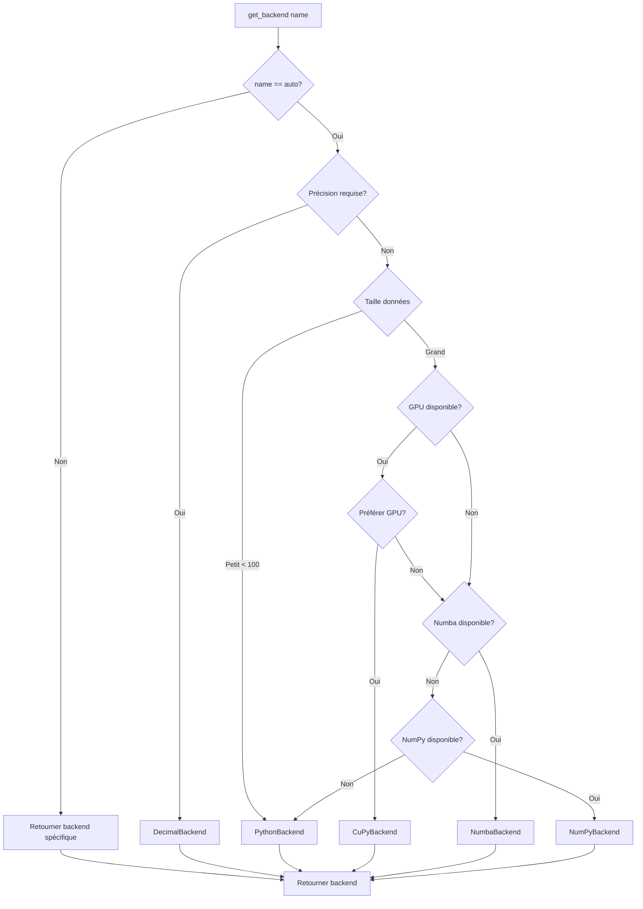
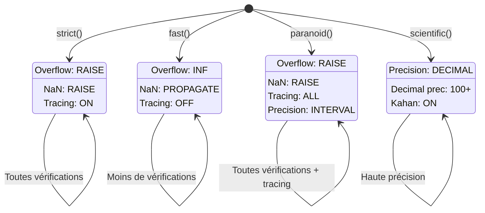
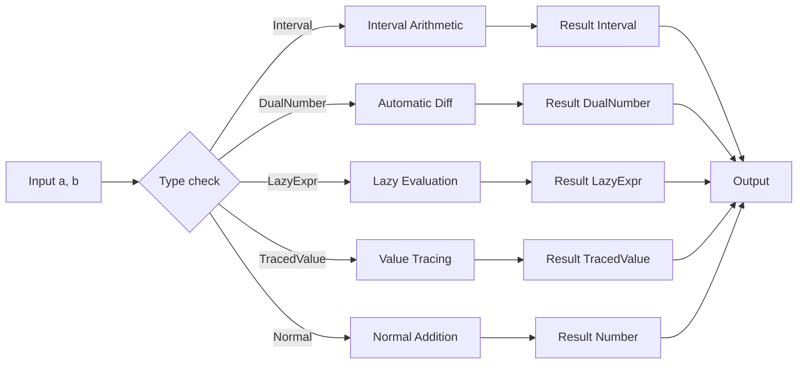

# Diagrammes et schémas

## Architecture système (Mermaid)



## Flux d'exécution d'une addition



## Hiérarchie des types



## Architecture des backends



## Système de tracing



## Sélection de backend



## Schéma ASCII simple

```
┌─────────────────────────────────────────────────────────┐
│                    USER APPLICATION                      │
└────────────────────┬────────────────────────────────────┘
                     │
                     ▼
         ┌───────────────────────┐
         │   nuclear_add.add()   │
         └───────────┬───────────┘
                     │
         ┌───────────▼───────────┐
         │   NuclearEngine       │
         │  ┌─────────────────┐  │
         │  │ NuclearConfig   │  │
         │  └─────────────────┘  │
         └───────────┬───────────┘
                     │
    ┌────────────────┼────────────────┐
    │                │                │
    ▼                ▼                ▼
┌─────────┐    ┌──────────┐    ┌──────────┐
│ Backend │    │  Types   │    │ Tracing  │
│         │    │          │    │          │
│ Python  │    │ Interval │    │ Tracer   │
│ NumPy   │    │ DualNum  │    │ Analyzer │
│ CuPy    │    │ LazyExpr │    │ Detector │
│ Numba   │    │ Traced   │    └──────────┘
│ Decimal │    │ Stochastic│
└─────────┘    └──────────┘
```

## États de configuration



## Flux de données avec types spéciaux



